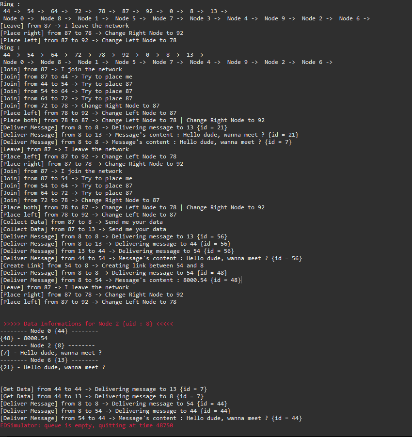

# Projet INFO833 Construction d'une DHT
GUERIOT Benjamin, NICOLAS Thomas

Projet réalisé en groupe dans le cadre de nos études à Polytech Annecy-Chambéry. 

Le but de ce projet est de concevoir et implémenter une DHT en dessus de PeerSim. C'est à dire créer un anneau composé de noeuds, chaque noeud ayant un identifiant unique.

Cet anneau va servir à stocker des données sur les noeuds en fonction de leurs indentifiants afin d'avoir une répartition équitable sur l'anneau.

# Architecture

## Arborescence

```python
📦 INFO833_Projet
├─ 📁 src
│  └─ 📁 fr
│     └─ 📁 usmb
│        ├─ 📁 dht  # Packages contenant les fichiers de la DHT
│        │  ├─ 📝 Controller.java   # Crée et envoi les actions au simulateur
│        │  ├─ 📝 DhtNode.java      # Gère les actions des nodes
│        │  ├─ 📝 HWTransport.java  # Conditionne l'envoi des messages
│        │  ├─ 📝 Initializer.java  # Initialise les nodes de l'anneau
│        │  ├─ 📝 Message.java      # Objet Message contenant ses informations
│        │  └─ 📝 MessagType.java   # Classe Enumeration pour les types de messages
│        └─ 📁 peersim   # Packages contenant les fichiers d'execution peersim
│           └─ 📝 Simulator.java  # Fichier de simulation
└─ 📝 config_file.cfg  # Fichier de configuration
```

## Technologies

Pour simuler notre DHT, nous utilisons le simulateur *Peersim* qui est un simulateur peer to peer pouvant simuler un très large nombre de nodes.

# Fonctionnalités développées

- Insertion de noeuds dans l'anneau
- Extraction de noeuds
- Envoi de messages entre deux noeuds
- Stockage de données par leurs identifiants
- Réplication des données avec un degré de 3
- Création et utilisation de tables de routage
- Maintient du routage en cas de départ ou arrivée de noeuds
- Maintient de la réplication des données en cas de départ ou arrivée de noeuds

# Explications techniques

## Initialisation

Afin de faire fonctionner notre DHT, il est nécessaire d'attribuer à chaque noeud un id unique (uid). Le premier noeud crée est le noeud initial de notre anneau, celui-ci est son propre voisin de gauche et son propre voisin de droite.

## JOIN / LEAVE

Lorsqu'un noeud rejoint la DHT, il doit être placé à la position correspondant à son uid. Ce noeud demande à un noeud aléatoire de la DHT de le placer, cette demande est effectué gràce à l'envoi d'un message de type **JOIN** au noeud choisi.
Le noeud aléatoire vérifie les uid de ses voisins de gauche et de droite pour savoir si le noeud doit être placé entre l'un des deux. Si le noeud à placer n'est pas situé entre le noeud actuel et l'un des ses voisins, le message est envoyé au voisin avec l'uid le plus proche de l'uid du noeud à placer.

Une fois l'emplacement pour le nouveau noeud trouvé, on envoie un message de type **PLACE_RIGHT** ou **PLACE_LEFT** avec le noeud à placer en contenu du message aux noeuds devenant les voisins de celui à placer. On envoie également un message de type **PLACE_BOTH** au noeud à placer pour qu'il change ses voisins.

Lorsqu'un noeud quitte la DHT, il envoie un message **PLACE_LEFT** à son voisin de gauche avec son voisin droite en contenu du message et inversement, il envoie un message **PLACE_RIGHT** à son voisin droit avec son voisin gauche en contenu de message.

Des messages sont ensuite envoyés à d'autres noeuds afin de supprimer les liens de routage ainsi que les données associées à ce noeud.

## DELIVER

Il est nécessaire de pouvoir faire circuler des informations dans notre DHT. Pour cela, nous utilisons un message de type **DELIVER** qui permet d'envoyer des messages à un autre noeud de l'anneau. Le message envoyé peut contenir n'importe quelle donnée, cette donnée est soit sauvegardable, soit unique (ping).

A la réception d'un message de type **DELIVER**, on vérifie plusieurs conditions: 

- L'id du message est soit situé entre le noeud actuel et son voisin de droite, soit en fin d'anneau (en terme d'uid, exemple: 900 -> 2), on délivre donc ce message au noeud actuel ou son voisin droit suivant l'uid le plus proche.
- L'id du message est soit situé entre le noeud actuel et son voisin de gauche, soit en fin d'anneau (en terme d'uid, exemple: 900 <- 2), on délivre donc ce message au noeud actuel ou son voisin gauche suivant l'uid le plus proche.
- L'id du message est égal à l'uid du noeud actuel, le message est donc délivré au noeud courant.
- L'id du message est égal à l'uid d'un de ses voisins, le message est délivré sur le voisin correspondant.

Si aucune de ces conditions n'est remplie, nous cherchons le noeud parmi les voisins et les noeuds présents dans la table de routage du noeud courant, c'est à dire le noeud avec l'uid le plus proche de celui du message. Le message est envoyé au noeud le plus proche trouvé.

## ADVANCED ROUTING

Le routage de proche en proche n'est pas performant, il est donc nécessaire d'implémenter une table de routage pour chaque noeud. Lors de l'envoi de messages, si le nombre de noeuds composant le chemin de transfert d'un message est supérieur ou égal à *Nombre de nodes / 3* arrondi à la valeur supérieure, un lien long est créé entre le noeud d'envoi initial et le noeud ayant reçu le message final. 

Cette table de routage est une HashMap composée de l'objet DhtNode associé à son id, ainsi les deux noeuds connaissent l'uid de l'un et de l'autre permettant un envoi direct des messages.

# Difficultés

 - Accès concurrent sur le même noeud

# Evolutions potentielles

- Mise en place du routage lors d'un JOIN
- Modification de la file d'attente globale en ajoutant un flag et une file d'attente sur chaque noeud pour gérer les accès concurrents

# Compétences acquises

- Compréhension du fonctionnement d'une DHT
- Utilisation de Simulateur (PeerSim)

# Exemple d'une execution

Dans l'image suivante, nous observons les logs des actions appliquées à la DHT



# Utilisation

Prérequis :
- Java 5 minimum

## Installation

Cloner le projet dans un répertoire :

`git clone https://github.com/Kaiden26/INFO833_Projet`

## Lancement

Ajouter les librairies *peersim-1.0.5.jar*, *jep-2.3.0.jar*, *djep-1.0.0.jar* et *peersim-doclet.jar*

Lancer la classe **Simulator.java** située dans *src/fr/usmb/peersim* avec l'argument *config_file.cfg*
